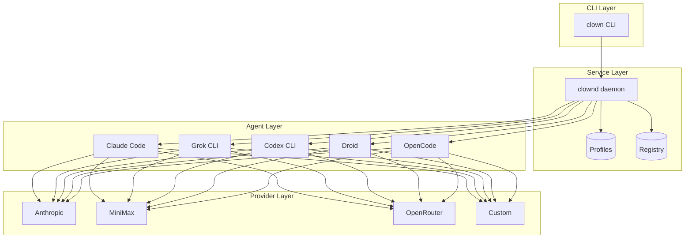

# clown

[](https://github.com/neul-labs/clown/actions/workflows/ci.yml)
[](https://crates.io/crates/clown)
[](LICENSE)
[](https://www.rust-lang.org)


**A cross-platform orchestrator for CLI-based coding agents.**

- **Unified management** for Claude Code, Grok CLI, Codex, Droid, OpenCode, and more
- **Provider abstraction** to swap between Anthropic, MiniMax, OpenRouter without config changes
- **Profile-based workflows** with isolated environments, credentials, and settings
- **Daemon-backed architecture** for consistent state and future UI integrations

## Quick Start

```bash
curl -fsSL https://raw.githubusercontent.com/neul-labs/clown/main/install.sh | sh
clown agents list
clown profiles create claude my-profile --provider anthropic
clown profiles run my-profile
```

## Architecture



The CLI is a thin client that **automatically starts the daemon** on first use. The daemon collects telemetry (profile invocations, session durations, resource consumption) and exposes it via `clown stats`. After an idle timeout the daemon exits unless pinned with `clown daemon --stay-alive`.

## Key Features

### Agent Management
- **One switchboard for every agent** – track installations of Claude Code, Grok CLI, Codex CLI, Droid, OpenCode without memorizing bespoke flags
- **Immediate observability** – `clown agents list` shows each installed agent, detected version, last-used timestamp, and profile count
- **Composable architecture** – extension manifests describe how to detect, configure, and run agents

### Provider Abstraction
- **Configure once, use anywhere** – set up API backends (Anthropic, MiniMax, OpenRouter) once, bind any agent to any provider
- **Intelligent routing** – enable per-profile proxy with ultrallm to route requests based on token count, tool usage, or custom rules
- **GitHub-backed registry** – manifests, templates, and model catalogs live in a public repository

### Developer Experience
- **Profiles per agent+provider** – create aliases like `claude-work-minimax` or `grok-home-anthropic` pinned to specific credentials
- **Executable aliases** – `clown aliases install <profile>` creates real commands with isolated homes and env vars
- **Prompted secrets** – profile creation always asks for model name, API keys, and manifest-required values
- **Event-driven hooks** – configure PreToolUse, PostToolUse, Notification, and Stop hooks for logging and integration
- **Rhai scripting** – configuration generation via embedded scripting engine

### Observability
- **Native usage tracking** – track token usage and costs across all profiles with built-in ccusage-like functionality
- **Telemetry collection** – profile invocations, session durations, resource consumption
- **Import from Claude** – import usage data from Claude's native files

## Project Status

| Component | Status |
|-----------|--------|
| Daemon (`clownd`) with auto-start and IPC | ✅ Implemented |
| CLI with full profile lifecycle | ✅ Implemented |
| Agent detection (Claude, Grok, Codex, Droid, OpenCode) | ✅ Implemented |
| Provider support (Anthropic, MiniMax, OpenRouter) | ✅ Implemented |
| Profile hooks (PreToolUse, PostToolUse, etc.) | ✅ Implemented |
| Proxy integration with ultrallm | ✅ Implemented |
| Rhai scripting engine | ✅ Implemented |
| HTTP/WebSocket APIs and Web UI | ✅ Implemented |
| Native token/cost usage tracking | ✅ Implemented |
| Plugin SDK for third-party manifests | 🔜 Planned |
| Cross-device profile sync | 🔜 Planned |

## CLI Preview

```text
$ clown agents list
┌────────────┬──────────────┬────────────┬──────────────┐
│ Agent      │ Version      │ Profiles   │ Default Model│
├────────────┼──────────────┼────────────┼──────────────┤
│ claude     │ 0.5.4        │ 3          │ MiniMax-M2.1 │
│ grok       │ 0.3.2        │ 1          │ grok-3       │
│ codex      │ 0.11.0       │ 1          │ MiniMax-M2.1 │
│ droid      │ 1.2.0        │ 0          │ gemini-2.5   │
│ opencode   │ 1.8.0        │ 2          │ MiniMax-M2.1 │
└────────────┴──────────────┴────────────┴──────────────┘

$ clown profiles create claude work-sonnet \
    --provider minimax \
    --model MiniMax-M2.1

$ clown aliases install work-sonnet
Installed shim ~/bin/claude-work-sonnet -> claude --settings ~/.claude-profiles/work-sonnet/.claude/settings.json

$ claude-work-sonnet /settings strict.json

$ clown env setup work-sonnet cli-remap
Executed manual env setup task "cli-remap" for profile work-sonnet

$ clown registry sync
Fetched registry commit f4a12c3 (stable channel)

# Create profile with proxy for intelligent routing
$ clown profiles create claude work-proxy --provider anthropic --proxy

# Manage proxy routing rules
$ clown proxy enable work-proxy
$ clown proxy route add work-proxy "long-context" "tokens > 100000" "minimax/claude-3-sonnet" --priority 10
$ clown proxy route add work-proxy "default" "always" "anthropic/claude-sonnet-4"
$ clown proxy route list work-proxy
$ clown proxy status

# Add event hooks to a profile
$ clown hooks add work-sonnet PreToolUse "Bash" "echo 'Running: $EVENT' >> /tmp/clown.log"
$ clown hooks list work-sonnet

$ clown profiles list --agent claude
Alias              Provider    Endpoint       Model           Last Used
work-sonnet        minimax     international  MiniMax-M2.1    2024-05-04T11:23:51Z
work-sre           minimax     international  MiniMax-M2.1    2024-05-03T09:18:12Z

# View token usage and costs
$ clown usage
$ clown usage --period month --profile work-sonnet
$ clown usage import-claude
```

## Getting Started

1. **Install via script** (recommended):
   ```bash
   curl -fsSL https://raw.githubusercontent.com/neul-labs/clown/main/install.sh | sh
   ```

2. **Or build from source**:
   ```bash
   # Install Rust toolchain
   rustup install stable

   # Clone and build
   git clone https://github.com/neul-labs/clown.git
   cd clown
   cargo build --release

   # Add to PATH
   export PATH="$PATH:$(pwd)/target/release"
   ```

3. **Verify installation**:
   ```bash
   clown agents list
   ```

4. **Create your first profile**:
   ```bash
   clown profiles create claude my-profile --provider anthropic
   clown profiles run my-profile
   ```

## Documentation

| Document | Description |
|----------|-------------|
| [Architecture](docs/architecture.md) | Component overview, data flow, and service plans |
| [Agents](docs/agents.md) | Manifests for supported agents and onboarding new ones |
| [Providers](docs/providers.md) | API backend definitions and custom provider setup |
| [Profiles](docs/profiles.md) | Profile lifecycle and CLI workflows |
| [Hooks](docs/hooks.md) | Event-driven hooks for logging and integration |
| [Proxy](docs/proxy.md) | Intelligent request routing via ultrallm |
| [Usage](docs/usage.md) | Token/cost tracking and Claude data import |
| [Scripting](docs/scripting.md) | Rhai scripting guide for configuration |
| [Registry](docs/registry.md) | GitHub registry layout and sync workflow |

## Contributing

Please open design discussions before implementing major features so that the manifest formats, profile persistence, and service APIs remain consistent. Refer to `docs/` for authoritative requirements, keep changes documented, and accompany new functionality with updates to the relevant guides.
